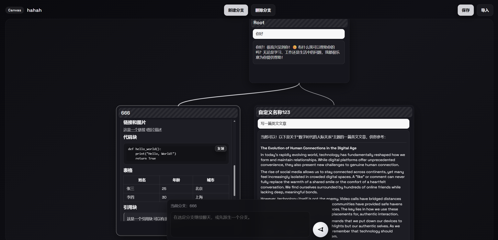

# CanvasChat

一个基于 LangChain 的“画布”聊天原型。不同于线性对话，它允许在同一界面上创建分支并保持各自上下文。支持Docker一键部署。

## 功能展示


## 主要特性
- 多分支：任意节点派生子分支，继承父节点上下文。
- 直观布局：节点可拖拽、缩放，自定义位置与大小。
- 文本阅读友好：折叠长回复、可复制代码块，支持滚动同步保存。
- 版本管理：导入/导出当前画布，便捷备份与分享。
- API 兼容：通过 OpenAI 协议配置自己的 LLM 端点。

## 环境配置
在 `.env` 或环境变量中提供：
```
CANVAS_API_KEY=your_key
CANVAS_BASE_URL=https://your-openai-like-endpoint/v1
CANVAS_MODEL=model_name
# 可选
CANVAS_SYSTEM_PROMPT=You are a helpful canvas chat assistant.
```

## Docker 部署
确保 `.env` 中已配置好 `CANVAS_API_KEY/CANVAS_BASE_URL/CANVAS_MODEL` 等变量，然后：
```
docker build -t canvaschat .
docker run -d --env-file .env -p 8886:8000 --name canvaschat-app canvaschat
```
访问 `http://127.0.0.1:8886` 即可使用。默认命令运行 `uvicorn app:app --host 0.0.0.0 --port 8886`，如需修改端口可调整 `docker run -p`。

## 通过源码部署

### 安装
```
pip install -r requirements.txt
```

### 运行前端 + 后端
启动 FastAPI（包含静态前端）：
```
uvicorn app:app --reload --port 8886
```
浏览器访问 `http://127.0.0.1:8886` 即可进入画布界面：
- 左上角可刷新画布、重命名画布。
- 右下输入区选择分支、发送消息（Ctrl+Enter 可一键发送）。
- 节点卡片右下角可拖拽调节大小，头部拖拽可移动位置，按钮派生分支。

## Star History

<a href="https://www.star-history.com/#Norsico/CanvasChat&type=date&legend=top-left">
 <picture>
   <source media="(prefers-color-scheme: dark)" srcset="https://api.star-history.com/svg?repos=Norsico/CanvasChat&type=date&theme=dark&legend=top-left" />
   <source media="(prefers-color-scheme: light)" srcset="https://api.star-history.com/svg?repos=Norsico/CanvasChat&type=date&legend=top-left" />
   
 </picture>
</a>

## 开发者指南
- 入口类：`canvas_chat.ChatCanvas`
  - `branch_from(node_id, title=None)`：从任意节点派生分支，继承父节点记忆。
  - `send(node_id, user_message)`：在指定分支发送消息，模型回复会追加到同一分支。
  - `history(node_id)`：查看该分支的完整消息列表。
  - `describe()`：获取当前画布概览。
  - `delete_subtree(node_id)`：删除指定分支及其子分支（保护 root）。
- 配置与模型：
  - `canvas_chat.CanvasConfig`：封装 `api_key/base_url/model/system_prompt`。
  - `canvas_chat.build_llm(config)`：返回 `ChatOpenAI`，可替换为任意 LangChain `BaseChatModel`。
  - `canvas_chat.load_config_from_env()`：从环境加载配置，便于脚本调用。
- Web 服务：`app.py`
  - `/api/nodes`：获取所有节点及其消息。
  - `/api/branch`：从指定节点派生分支。
  - `/api/message`：在指定分支发送消息并返回最新记录。
  - `/api/delete`：删除节点及其子分支。
  - `/`：静态前端（`static/index.html`）。
